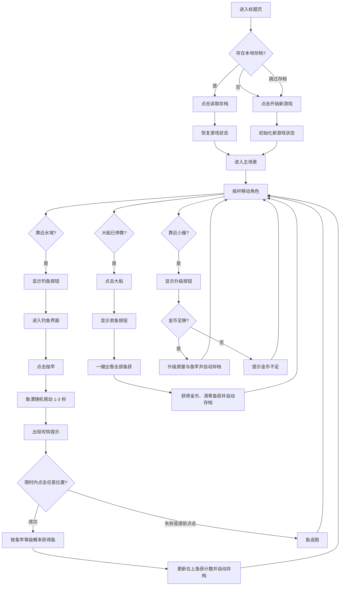

## 1. 产品概述
这是一款竖屏、顶视角、像素风的海边小岛钓鱼休闲游戏，面向手机单手触屏操作场景，玩家通过移动、钓鱼、卖鱼和升级形成短周期成长循环。
- 主要目标是提供轻量、可重复、零门槛的钓鱼养成体验，用最少系统实现稳定的“操作反馈-资源累积-成长强化”乐趣。
- 产品价值在于单文件即可运行、无外部依赖、打开即玩，适合作为移动网页小游戏原型与成品演示。

## 2. 核心功能

### 2.1 功能模块
1. **主场景页面**：岛屿地图、角色移动、水域与小屋交互、船只停靠、顶部资源信息、底部触控 UI。
2. **钓鱼操作界面**：半透明全屏覆盖、抛竿流程、鱼漂等待、咬钩提示、限时拉杆判定与结果结算。
3. **升级与售卖反馈**：房屋升级面板、金币校验、鱼竿同步强化、游客船卖鱼按钮与收益结算。
4. **标题页与存档入口**：进入游戏先显示标题页，提供“读取存档”和“开始新游戏”两个入口。

### 2.2 页面明细
| 页面名称 | 模块名称 | 功能说明 |
|-----------|-----------|-----------|
| 主场景页面 | 左上状态栏 | 显示金币数、鱼竿等级、房屋等级、船只倒计时 |
| 主场景页面 | 右上鱼获栏 | 常驻显示普通、稀有、珍贵鱼获数量 |
| 主场景页面 | 左下摇杆 | 支持单指拖拽，控制角色四向移动 |
| 主场景页面 | 右下情境按钮 | 根据角色位置显示“钓鱼”“升级”“卖鱼”等操作 |
| 主场景页面 | 小岛场景 | 展示海水、沙滩、码头、小屋、树木、桥边停船区域 |
| 标题页面 | 存档入口 | 显示游戏标题、存档状态、读取存档按钮、新游戏按钮 |
| 钓鱼操作界面 | 半透明遮罩 | 保留场景氛围，突出钓鱼操作 |
| 钓鱼操作界面 | 抛竿按钮 | 玩家主动开始一轮钓鱼 |
| 钓鱼操作界面 | 咬钩提示 | 中央显示“咬钩！”，进入限时点击判定 |
| 升级与售卖反馈 | 升级面板 | 显示当前等级、下一级价格、是否可升级 |
| 升级与售卖反馈 | 卖鱼面板 | 显示一次性出售总价并执行清空鱼获 |

## 3. 核心流程
玩家进入页面后，先看到标题页。若检测到本地存档，则可选择“读取存档”继续游戏；也可选择“开始新游戏”从初始状态进入主场景。进入小岛后，通过左下摇杆移动角色。靠近海边时可进入钓鱼界面，完成抛竿与咬钩判定后获得随机鱼获并自动返回主场景。鱼获直接累计到右上角统计中，不进入背包。每隔 240 秒游客大船停靠码头，玩家点击船只后可一键出售所有鱼获换取金币。金币用于在小屋前升级房屋，房屋等级同步提升鱼竿等级，从而增强稀有鱼、珍贵鱼概率并略微延长咬钩判定时间窗口。游戏在关键状态变化后自动写入 Local Storage，用于下次继续游玩。

## 4. 用户界面设计
### 4.1 设计风格
- 主色调：明亮暖色海岛风，海水使用青蓝渐变，沙滩使用奶油米色，植被使用偏黄绿色，房屋使用橙棕木质色。
- 按钮样式：半透明圆角按钮，带像素描边与轻微投影，适合拇指点击。
- 字体与字号：正文使用系统无衬线字体，标题与按钮配合像素风字距与描边效果。
- 布局方式：竖屏全屏场景为主，HUD 固定四角，操作按钮不遮挡核心视区。
- 图标风格：鱼类使用纯色像素图标表达稀有度，金币使用高亮圆形像素币。

### 4.2 页面设计概览
| 页面名称 | 模块名称 | UI 元素 |
|-----------|-----------|-----------|
| 主场景页面 | 顶部 HUD | 金币、等级、鱼获文本、倒计时标签、柔和半透明底板 |
| 标题页面 | 标题面板 | 游戏标题、副标题、存档状态文案、读取存档与新游戏双按钮 |
| 主场景页面 | 地图场景 | 顶视角岛屿、水域边缘、小屋、树木、岩石、码头、来船动画 |
| 主场景页面 | 移动与交互 | 左下圆形摇杆、右下情境按钮、点击船只出现售卖按钮 |
| 钓鱼操作界面 | 钓鱼层 | 半透明深色遮罩、鱼漂、水波纹、中央提示文案、右下抛竿按钮 |
| 升级与售卖反馈 | 弹窗层 | 像素风面板、价格信息、不可购买灰态、金币不足提示 |

### 4.3 响应式策略
- 以手机竖屏为第一优先，目标分辨率覆盖 360x640 到 430x932。
- 所有交互按钮最小点击区不小于 64x64 像素。
- 摇杆与情境按钮固定在安全区域，兼容刘海屏和底部手势区域。
- 游戏逻辑与渲染尺寸分离，使用缩放适配不同 DPR。
