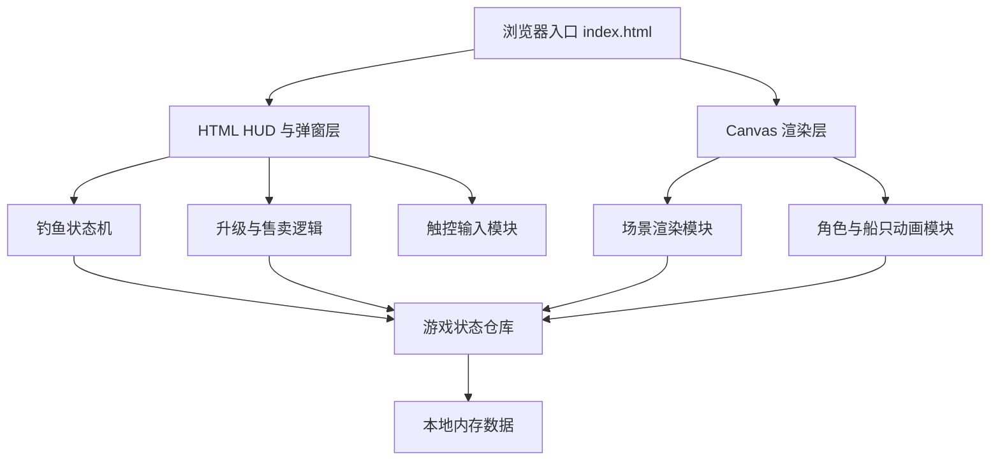

## 1. 架构设计


## 2. 技术说明
- 前端：原生 HTML5 + CSS3 + JavaScript，无第三方依赖。
- 渲染方式：单个 `canvas` 负责地图、角色、船只、鱼漂、水波等实时绘制。
- UI 层：原生 HTML 按钮、文本与面板，负责摇杆、状态栏、钓鱼按钮、升级按钮、售卖按钮与提示。
- 状态管理：单一 `gameState` 对象集中管理金币、等级、鱼获、船只计时、角色位置、钓鱼流程状态。
- 动画机制：使用 `requestAnimationFrame` 驱动；使用时间戳推进倒计时、船只到离场、鱼漂抖动与提示闪烁。
- 数据持久化：首版无需本地存档，刷新后重新开始。

## 3. 路由定义
| 路由 | 用途 |
|-------|------|
| / | 加载完整小游戏页面与所有逻辑 |

## 4. 模块定义
| 模块名称 | 职责 |
|-----------|------|
| `boot` | 初始化画布尺寸、事件监听、游戏循环 |
| `renderScene` | 绘制岛屿、海面、房屋、树木、码头、船只、角色 |
| `renderUi` | 同步 HUD、按钮显隐、文本、弹窗与提示 |
| `inputController` | 处理摇杆拖拽、点击交互、场景点击命中 |
| `fishingSystem` | 控制抛竿、等待咬钩、判定成功失败、掉落鱼种 |
| `boatSystem` | 控制 240 秒刷新、7 秒停靠倒计时、售卖状态与离场 |
| `upgradeSystem` | 计算升级价格、升级条件、鱼竿概率与判定窗口增益 |
| `economySystem` | 计算鱼获总售价、金币增减与鱼获清零 |

## 5. 核心数据结构
```js
const gameState = {
  gold: 0,
  houseLevel: 1,
  rodLevel: 1,
  fishCounts: { common: 0, rare: 0, precious: 0 },
  player: { x: 0, y: 0, radius: 0 },
  joystick: { active: false, dx: 0, dy: 0 },
  boat: {
    phase: "waiting",
    nextArrivalAt: 0,
    departAt: 0,
    docked: false
  },
  fishing: {
    active: false,
    phase: "idle",
    biteAt: 0,
    resolveAt: 0,
    pendingFish: null
  },
  toast: { text: "", visibleUntil: 0 }
}
```

## 6. 概率与数值规则
### 6.1 基础鱼种参数
| 鱼种 | 基础概率 | 单价 |
|------|----------|------|
| 普通鱼 | 70% | 5 金币 |
| 稀有鱼 | 25% | 20 金币 |
| 珍贵鱼 | 5% | 50 金币 |

### 6.2 鱼竿升级增益
- 鱼竿等级始终与房屋等级同步。
- 每升 1 级，在基础值上增加：
- 稀有鱼概率 `+3%`
- 珍贵鱼概率 `+1%`
- 咬钩点击判定窗口 `+0.1 秒`
- 普通鱼概率由剩余概率自动补足为 `100% - 稀有 - 珍贵`
- 最高等级为 4 级。

### 6.3 升级价格
| 目标房屋等级 | 消耗 |
|--------------|------|
| 2 级 | 50 金币 |
| 3 级 | 200 金币 |
| 4 级 | 300 金币 |

## 7. 场景交互判定
- 水域边缘设定为一条可钓鱼触发带，角色进入指定半径范围时显示“钓鱼”按钮。
- 小屋门前设定升级触发区，角色进入范围时显示“升级”按钮。
- 船只停靠时，点击船体判定区域后显示“卖鱼”按钮。
- 情境按钮按优先级显示：售卖 > 钓鱼 > 升级。

## 8. 测试与验证方案
- 手动验证角色移动、情境按钮切换、钓鱼成功失败、售卖清零、金币结算、升级锁定与灰态。
- 通过浏览器预览检查竖屏布局、按钮尺寸、文案与触屏交互。
- 使用控制台与可视状态验证船只 240 秒逻辑和 7 秒离港逻辑。
